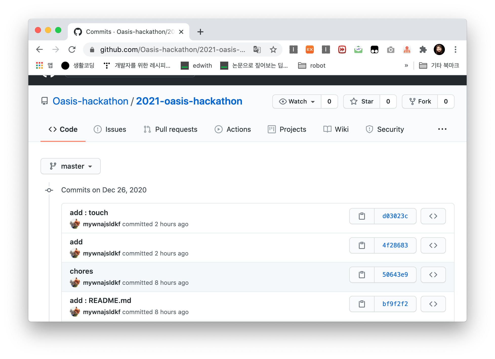

# git/github tutorial

본 문서는 Git/Github이 처음이신 참가자들을 위한 Git/Github 및 간단한 명령어와 기능 소개를 담은 문서입니다.

1. Git/Github란?

2. Git의 명령어 소개

   add, commit, push, branch, clone

3. Github 기능 소개

   pull request, issue, review, merge

4. 시작해보기

5. 더 알아보기!

   

## Git/Github란?

### Git이 무엇인가요?

- 효율적인 버전 관리 시스템을 사용하기 위해
- 빠르게 협업환경을 조성할 수 있음
- 여러 사람들과 함께 누가, 언제, 무엇을 수정했는지 리뷰가능
- Github을 이용해 자신의 local에서 개발한 내용 공유 가능
- visual studio, IntelliJ, Android Studio 등 다양한 IDE에서 git 연동 제공


### GitHub은 왜 사용하나요?

- Git의 데이터를 저장하는 서버의 역할을 함
- 커뮤니티 기능이 잘 되어 있음. (Issue를 통한 버그 제시 등)

- 코드를 보면서 의견을 나눌 수 있음(리뷰 기능)
- 오픈 소스의 발전에 영향을 미침


### Git/Github란?

여러 대의 **컴퓨터**들(Git)과 하나의 **메인서버**(GitHub)가 **소통**하는 관계


## Git의 명령어소개

add, commit, push, branch, clone

- **add**

  저장을 원하는 파일들을 묶어 올리겟다. / 스테이지에 올린다.

  *(내가 구현한 기능을 전달하기 위한 준비 단계를 한다.)*

- **commit**

  저장하는 파일들을 묶어서 **save** 하겠다.

  *(내가 구현한 기능들은 말이지... "horse"야!)*

- **push**
  내 컴퓨터에 저장된 작업 내용을 github에 업로드한다.

  *(내가 "horse"를 구현했는데 너희들에게 보낼게! 확인 부탁해!)*

- **branch**

  개발 영역을 분담해서 작업할 때, 충돌 예방 방지를 위해 자체에서 개별 branch를 생성해, 기존에 있던 내용을 가져와 개별적으로 작업한다.

  *(너가 'horse'를 구현했으니! 나는 'dolphin'을 구현해야겠군!)*

- **clone**

  원격 저장소 내려 받기(저장소 복제하기)

  *(개발해둔 horse v1 기반으로 v1.1을 만드려는데 기존에 작성한 코드를 참고해야겠다.)*


## GitHub의 기능소개

pull request, review, merge

- **pull request**

  Github의 강력한 협업 기능

  *(세상 사람들! 우리 'horse'가 걸을 수 있어요~ 한번 이상 없는지 봐주세요!)*

- **review**

  pull request내용을 점검하는 기능, 리뷰를 통해 공동 학습 할 수 있음

  *(오! 네 알겠습니다. 음 'horse'의 이 부분은 좀 더 수정봐야할 것 같아요!)*

- **merge**

  각자의 branch를 합치는 과정


## 시작해보기

### 설치

아래의 바로가기를 통해 진행해주세요!

[바로가기](https://git-scm.com/downloads)

### 설정

1. git의 config 과정을 진행합니다.	

   ```
   $ git config --global user.name "username"
   $ git config --globas user.email "useremail@email.com"
   ```

2. `git clone` 명령어를 통해 원격저장소에 저장된 파일을 컴퓨터로 복사해옵니다.

   ```
   $ git clone https://github.com/Oasis-hackathon/2021-oasis-hackathon.git 
   ```

   |                        주소 복사하기                         |          terminal           |
   | :----------------------------------------------------------: | :-------------------------: |
   |  |  |

   `git clone` 을 통해 원격파일을 복사해오면, `origin`에는 `clone`해온 리모트 URL이 저장되있습니다.

   

### 소스 기록, 커밋, 업로드

1. 개발을 진행하신 후 `git add` 명령어를 이용해서 소스 코드를 업로드 합니다.

   ```
   $ git add . 
   ```


- **`add` 좀 더 알아볼까요?!**

  `git add <파일/디렉토리 경로>`

  작업 디렉토리의 변경 내용의 일부만 스테이징 영역에 넘기고 싶을 때 수정한 파일이나 디렉토리의 경로를 인자로 넘깁니다.

  `git add -A`

  작업 디렉토리 상에 어디에 위치하든 항상 동일하게 모든 변경 내용을 스테이징으로 넘깁니다.

  `git add .`

  명령어를 실행한 디렉토리 이하에서 발생한 변경 내용만 포함하며, 해당 디렉토리 기존으로 상위 디렉토리의 변경 내용을 포함하지 않습니다.

2. `git remote show origin` 을 통해 origin에 리모트 주소가 잘 등록되었는지 확인해봅니다.

3. 변경된 내용을 기록하기 위해 `commit` 작업을 진행합니다.

   ```
   $ git commit -m "add : commit message"
   ```

   - 커밋은 시간순으로 저장됩니다. 최근 커밋부터 거슬러 올라가면 과거 변경 이력과 내용을 확인할 수 있습니다.
   - 각 커밋은 영문/숫자로 이루어진 40자리 고유 이름이 붙습니다. 생성된 커밋 이름을 보고 각 커밋을 구분하고 사용합니다.
     - 버그 수정, 기능 추가 등 특별한 의미가 있는 업데이트를 작업 별로 구분해서 각각 커밋하면, 나중에 이력을 보고 특정 변경 내용을 찾기 쉽답니다.
   - 커밋 메시지는 필수로 입력해야 합니다. 원활한 협업을 위해서 적절한 commit message 사용이 정말 중요한데요! 좀 더 알아보고 싶으신 분들은 바로가기를 클릭해주세요. [바로가기](https://tttsss77.tistory.com/58)

   ```
   $ git status
   ```

   `git status` 명령어를 사용하면 현재 파일 상태를 확인 할 수 있습니다.

   

4. `git push` 를 통해 작업한 내용을 github에 업로드합니다.

   ```
   git push origin master
   ```

   **origin** 원격 저장소(remote)의 주소입니다. (*이 예시에서는 https://github.com/Oasis-hackathon/2021-oasis-hackathon 이 되겠지요?*)

   **master** 현재 자신이 위치한 branch 이름을 말합니다. *(이 예시에서는 master branch에 작업한 내용을 업로드하고 있네요!)*

   

   저장소에 방문하면 다음과 같이 업로드 된 것을 확인할 수 있습니다.

   

## 더 알아보기!

소스 기록, 커밋, 업로드 기능을 모두 마스터하셨나요? 

위 단계만 잘 따라오셔도 대회 참여에는 아무 문제 없어요! 그래도 좀 더 알아보고 싶다면 다음 링크를 클릭해주세요!

git/github 좀 더 알아보기

git/github를 이용해 효과적으로 협업하기

### Reference)

https://backlog.com/git-tutorial/kr/intro/intro1_3.html

https://www.pigno.se/barn/tutorial-git/docs/#/